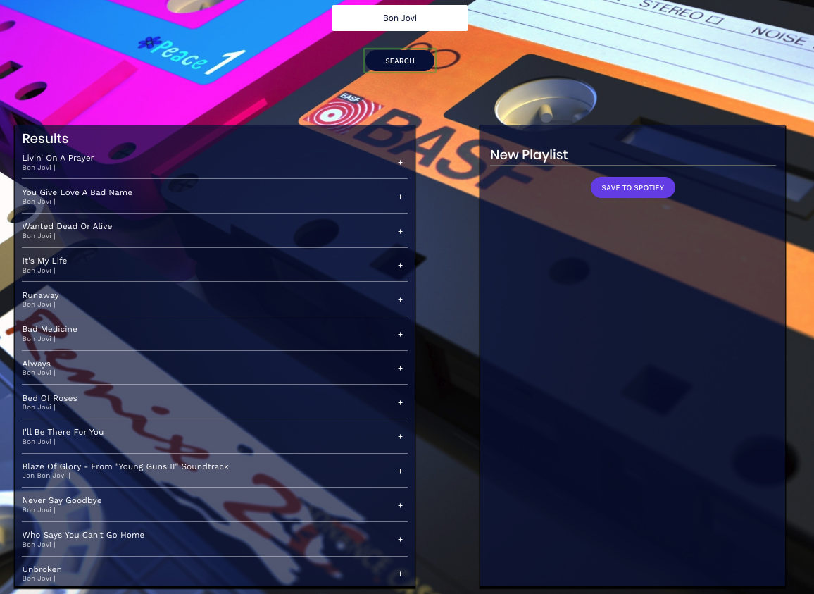

# Jammming React App

This project was bootstrapped with [Create React App](https://github.com/facebook/create-react-app).

## Available Scripts

In the project directory, you can run:

### `npm start`

Runs the app in the development mode. 
Open [http://localhost:3000](http://localhost:3000) to view it in the browser.

The page will reload if you make edits. 
You will also see any lint errors in the console.

### `npm test`

Launches the test runner in the interactive watch mode. 
See the section about [running tests](https://facebook.github.io/create-react-app/docs/running-tests) for more information.

### `npm run build`

Builds the app for production to the `build` folder. 
It correctly bundles React in production mode and optimizes the build for the best performance.

The build is minified and the filenames include the hashes. 
Your app is ready to be deployed!

See the section about [deployment](https://facebook.github.io/create-react-app/docs/deployment) for more information.

### `npm run eject`

**Note: this is a one-way operation. Once you `eject`, you can’t go back!**

If you aren’t satisfied with the build tool and configuration choices, you can `eject` at any time. This command will remove the single build dependency from your project.

Instead, it will copy all the configuration files and the transitive dependencies (Webpack, Babel, ESLint, etc) right into your project so you have full control over them. All of the commands except `eject` will still work, but they will point to the copied scripts so you can tweak them. At this point you’re on your own.

You don’t have to ever use `eject`. The curated feature set is suitable for small and middle deployments, and you shouldn’t feel obligated to use this feature. However we understand that this tool wouldn’t be useful if you couldn’t customize it when you are ready for it.

## Learn More

You can learn more in the [Create React App documentation](https://facebook.github.io/create-react-app/docs/getting-started).

To learn React, check out the [React documentation](https://reactjs.org/).

### Code Splitting

This section has moved here: https://facebook.github.io/create-react-app/docs/code-splitting

### Analyzing the Bundle Size

This section has moved here: https://facebook.github.io/create-react-app/docs/analyzing-the-bundle-size

### Making a Progressive Web App

This section has moved here: https://facebook.github.io/create-react-app/docs/making-a-progressive-web-app

### Advanced Configuration

This section has moved here: https://facebook.github.io/create-react-app/docs/advanced-configuration

### Deployment

This section has moved here: https://facebook.github.io/create-react-app/docs/deployment

### `npm run build` fails to minify

This section has moved here: https://facebook.github.io/create-react-app/docs/troubleshooting#npm-run-build-fails-to-minify

### **App Description:**
Jammming is a React application that allows users to search for songs, artists, or albums. Users can then easily create customized playlists and push those playlists to their Spotify account for future enjoyment. All components of this single page application are dynamically updated using React JS. The app utilizes Spotify API in order to return search results pertaining to their queries typed into the search field. The app makes it simple to dynamically add/remove songs to a custom playlist with the click of a button. The playlist name can also be customized to the user's preference. Once a custom playlist is completed, the user can simply press the 'add to Spotify' button and push that playlist to their actual Spotify account. Users must have an active account with Spotify in order to use this app.   
 
_____

### **Instructions for Using API**
* User must register for a client_id through spotify (https://developer.spotify.com/dashboard/login)
* Open root directory of project in terminal and run: "npm install dotenv" and confirm it is added to package.json file as a dependency.
* Create a .env file in the projects root directory
* In .env file, enter your Client_Id prepended with "REACT_APP_", 
    example: REACT_APP_CLIENT_ID=ENTER_YOUR_CLIENT_ID_HERE
* remember to add your ".env" file to a .gitignore file if committing project to GitHub!
* Must make a reference in your file where the ClientId is defined/used. At the top of the file 
    type: require('dotenv').config();
* Set your ClientId variable to a template literal, 
    example: const Client_Id = `${process.env.REACT_APP_CLIENT_ID}`
* See file named '.env_sample' for reference
 
_____

### **Demo Screenshots**
##### Jammming
* The Landing Page!

 

* Search Results for artists, songs, or albums!

 

* Add Customized Playlists to Your Spotify Account!

 
_________

### **Core Technologies Used**
* HTML5
* CSS
* Google Fonts
* JavaScript
* React JS
* JQuery
* AJAX
* XML/JSX
* Spotify API
 
_____

### **Built With**
* Visual Studio Code